基于 Spring Boot 的电影订票及评论网站（程序+论文）
=

### 完整代码获取地址：从戎源码网 ([https://armycodes.com/](https://armycodes.com/))
### 作者微信：19941326836  QQ：952045282 
### 承接计算机毕业设计、Java毕业设计、Python毕业设计、深度学习、机器学习
### 选题+开题报告+任务书+程序定制+安装调试+论文+答辩ppt 一条龙服务
### 所有选题地址https://github.com/nature924/allProject

一、项目介绍
---

基于 Spring Boot + Vue 的电影订票及评论网站，系统角色为后台管理员（管理端）和普通用户（前端用户），主要功能如下

后台管理员：
基本操作：登录、修改密码、获取/修改个人信息、登出
用户管理：用户分页查询、查看详情、新增、修改、删除、重置密码、获取 session 信息
电影管理：电影分页/列表、查看详情、添加、修改、逻辑删除、上下架管理、图片上传、字典字段转换（类型、上下架等）
订单管理：订单分页/列表、查看详情、保存、修改、删除订单状态管理（发货、收货、退款）
评论管理：影评分页/列表、查看详情、添加/回复、删除
收藏管理：电影收藏的增删查（用户收藏/取消/列表）
公告/配置管理：公告（news）管理、站点配置/轮播图管理（配置 CRUD、前端展示）

普通用户（前端）：
基本操作：注册、登录、退出、重置密码、获取/修改个人信息、查看个人中心
电影浏览：电影列表、详情、筛选、按类型/关键词排序
购票/下单：选座下单、余额支付校验、生成订单、查看订单列表与详情、申请退款、评价订单（生成评论）
评论与收藏：对电影发表评论、查看评论、收藏/取消收藏电影、查看个人收藏列表

二、项目技术
---
- 编程语言：Java
- 数据库：MySQL
- 项目管理工具：Maven
- 前端技术：VUE、HTML、Jquery、Bootstrap
- 后端技术：Spring、SpringMVC、MyBatis

三、运行环境
---
- 操作系统：Windows、macOS都可以
- JDK版本：JDK1.8以上都可以
- 开发工具：IDEA、Ecplise、Myecplise都可以
- 数据库: MySQL5.7以上都可以
- Tomcat：任意版本都可以
- Maven：任意版本都可以

四、运行截图
---
### 论文截图：
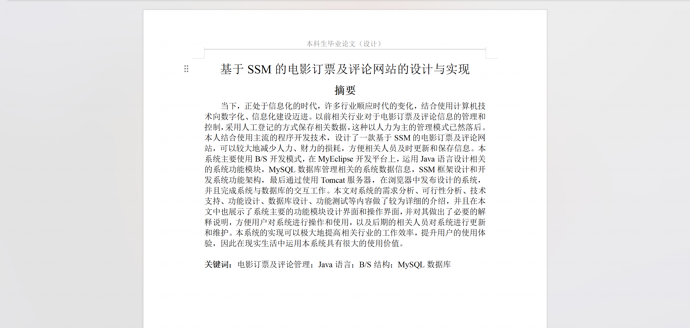

### 程序截图：
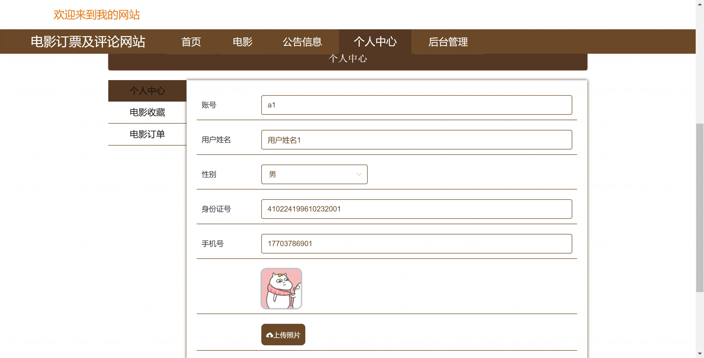

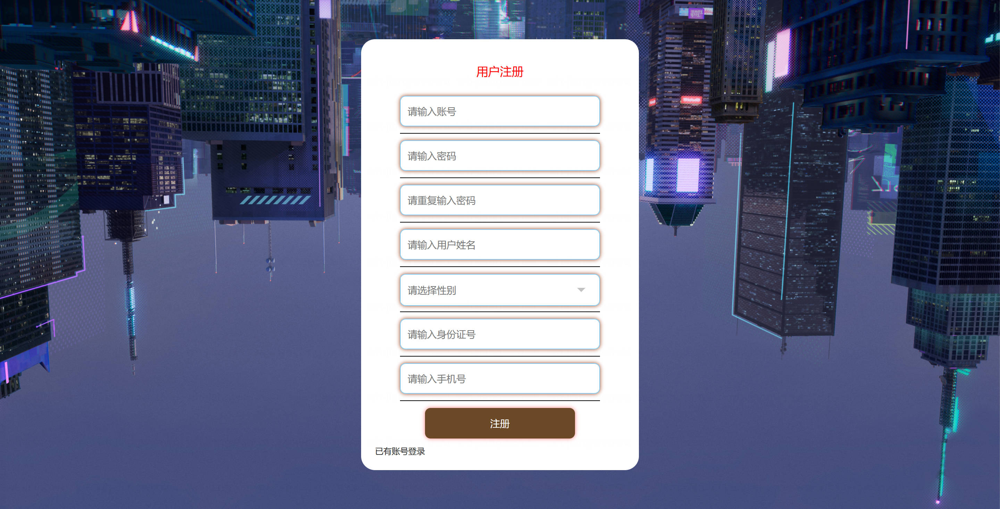
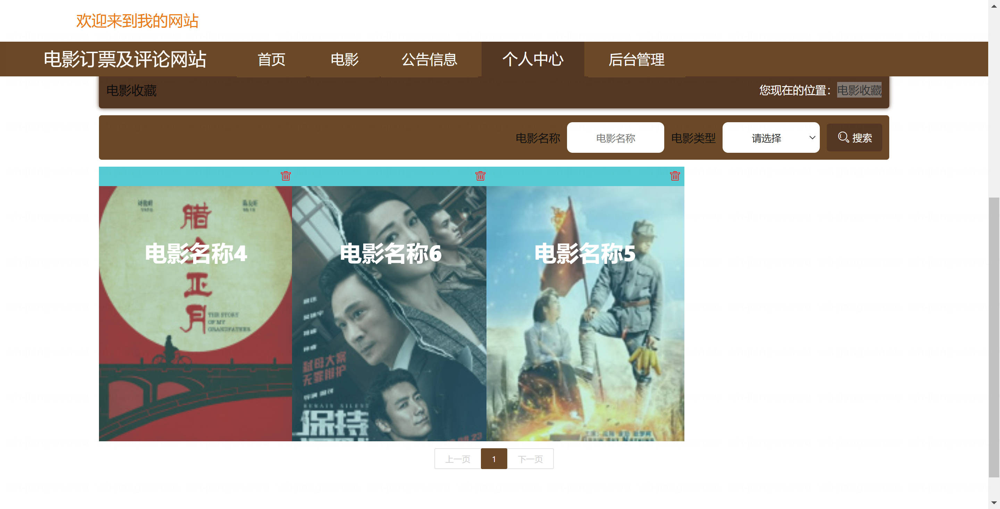

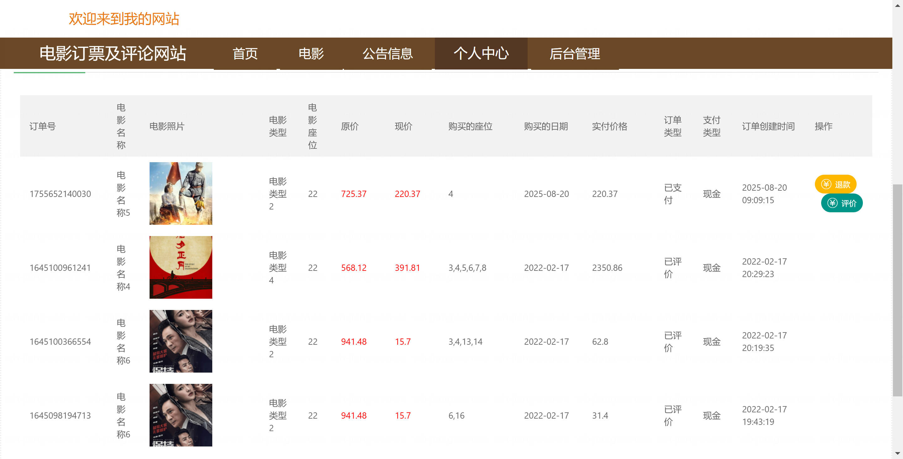
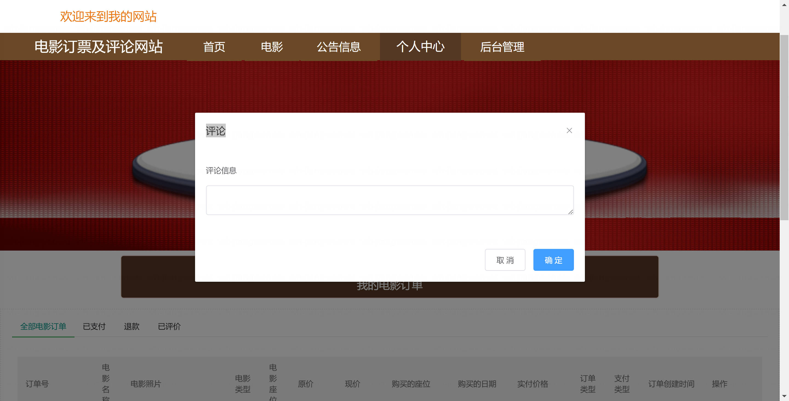
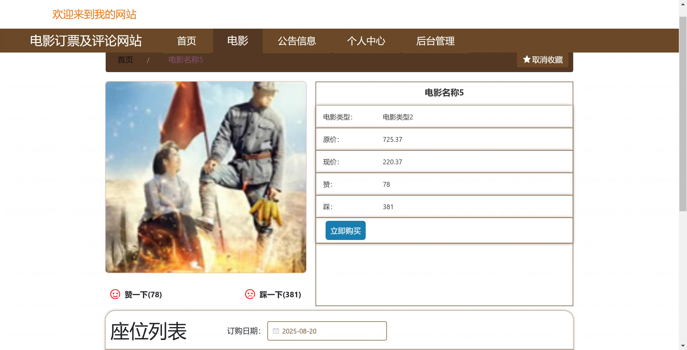
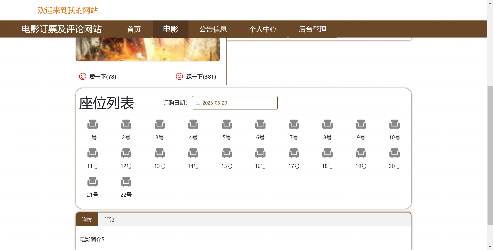
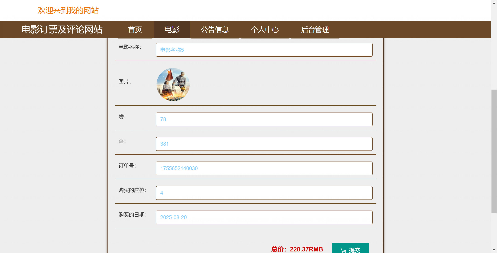

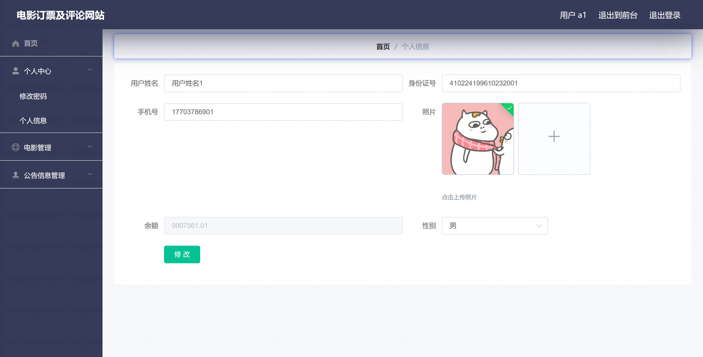
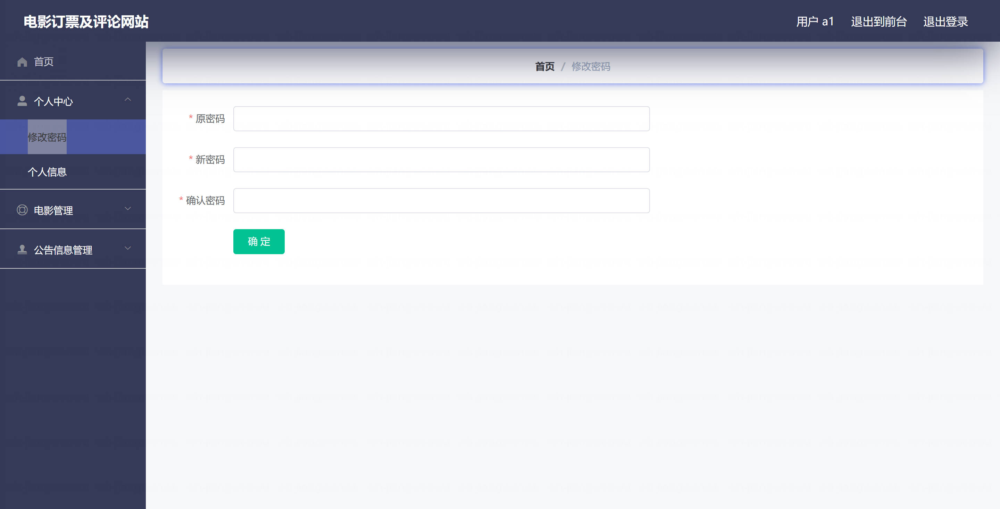
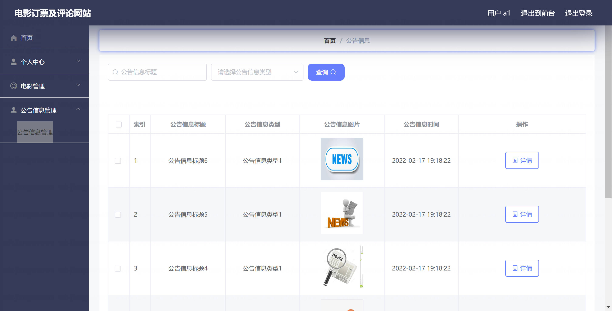

